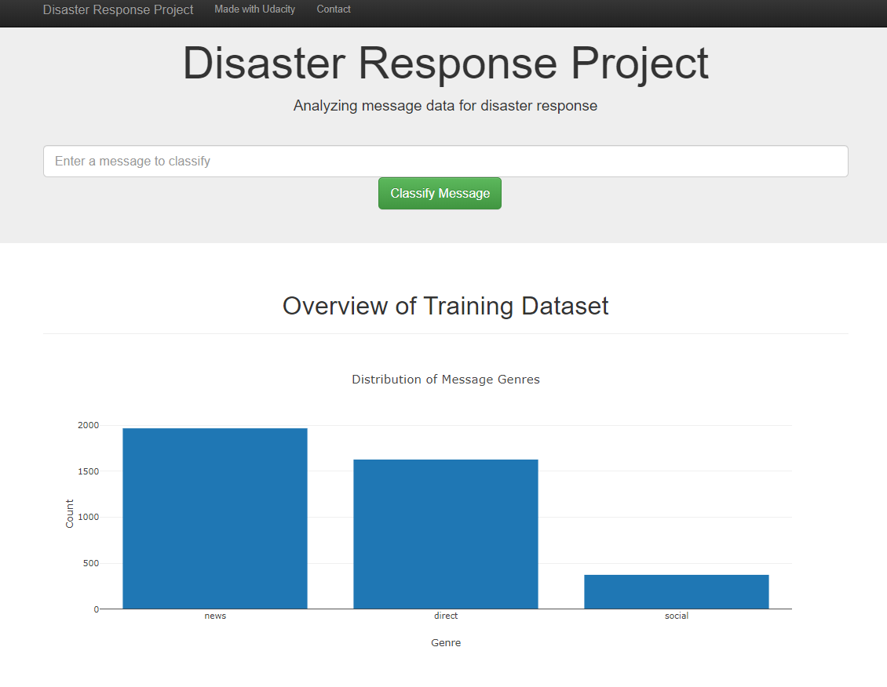
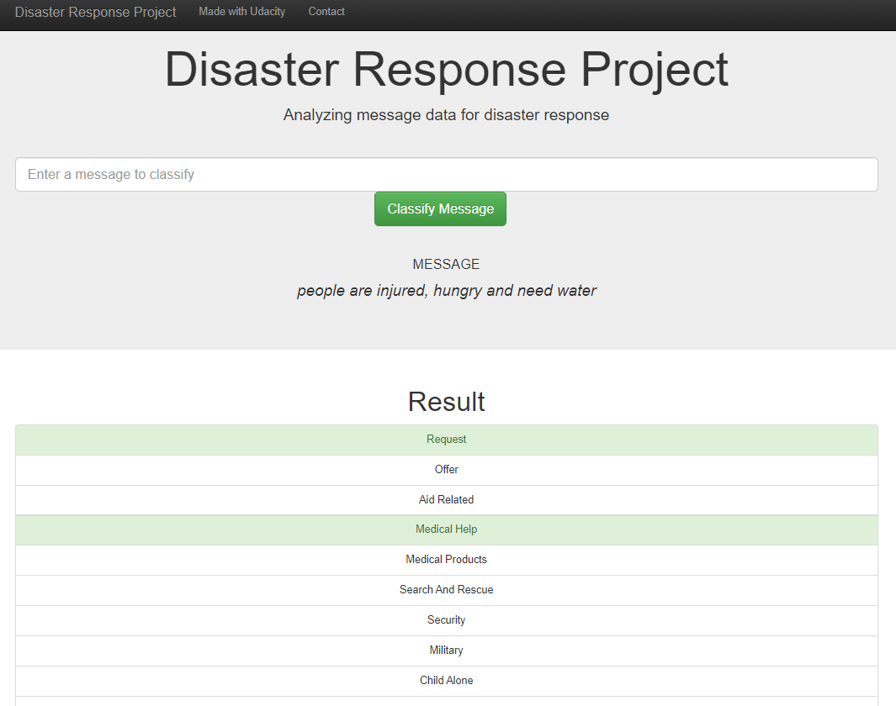

# Disaster Response Pipeline
Portfolio [Link](https://github.com/sergatron/Portfolio)

## Motivation
The goal of this project is to classify raw text disaster messages such that they can be forwarded automatically to appropriate relief agencies. This is something that is overwhelming for humans to classify when there may be thousands of messages coming in every minute. 

There are 36 categories associated with each message. Some of the categories include "Food", "Water", "Shelter", "Security", etc. Each message can be classiffied with multiple categories since each one may be requesting a variety of aid or service. 

The outcome of this project provides a platform (web application) for an emergency worker to enter a message for classification. The resulting output is a classification of multiple categories that the message relates to. 

For example, a message is entered, "we need food and clothing". The output would produce a positive instance in the following categories, "Request", "Food", and "Clothing". 

### Home Page

Displays some visuals and requests user's query for prediction.



### Predictions Page

Predicted categories are highlighted.




# Structure
```
disaster_response_project
  |
  |___ app
  |       |
  |       |__ run.py
  |       |__ templates
  |                   |__ go.html
  |                   |__ index.html
  |
  |___ data
  |        |__ process_data.py
  |        |__ disaster_response.db
  |
  |___ models
            |__ train_classifier.py
            |__ disaster_clf.pkl
  ```
  
# File Description
```
-- app 
    |__ run.py: loads database file and model, renders plots, and classifies queries using loaded model
    |__ templates
            |__ go.html: classification output page.
            |__ index.html: homepage.
            
-- data 
    |__ process_data.py: merges and cleans (2) CSV files, disaster_messages.csv and disaster_categories.csv, 
                             then writes clean data to a database file.
    |__ disaster_messages.csv: original data, contains messages.
    |__ disaster_categories.csv: original data, contains categories.
    |__ disaster_response.db: clean data.
    
-- models
    |__ train_classifier.py: loads from database, trains and tunes hyper-params, outputs a pickled model.
    |__ disaster_clf_.pkl: pickled model.
    
```

# Usage
For reproducibility, this repo may be cloned. Once cloned, scripts must be executed sequentially to clean data and train classifier. Then the web app may be run locally. 

**NOTE**: Before running the web app, you may need to change a few lines to specify correct directories so that the data and model are loaded properly.

In general, the following steps need to performed:
 1. Clone repo
 2. Process data
 3. Train classifier
 4. Run web app


Copy repo:

```$ git clone https://github.com/sergatron/disaster-response-project.git```


From 'data/' directory, execute script to proccess data; the last argument provides name for your database:

```python process_data.py disaster_messages.csv disaster_categories.csv <database_name>```

Train classifier:

```python models/train_classifier.py data/<database_name>.db models/<your_model>.pkl```

Run web app:

```python app/run.py```


# Acknowledgments
This project is part of the Data Engineering lesson offered by Udacity's Data Science Nanodegree. The templates used here are provided by [Udacity](https://www.udacity.com/).


